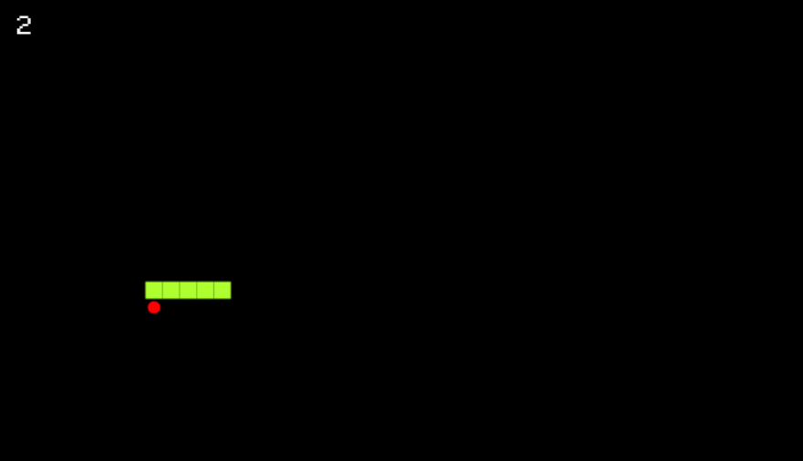
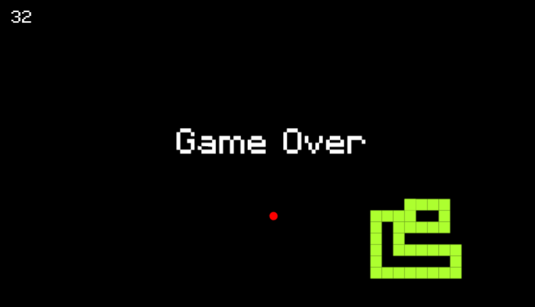

# Snake-JS
The Original Snake game using Vanilla JS &amp; HTML Canvas. 

The game involves controlling a snakehead by turning only left or right by ninety degrees until you manage to eat an apple. When you get the apple, the Snake grows an extra block.
## Screenshots

